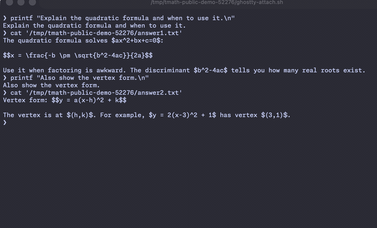

# terminal-math

Render Markdown and LaTeX as scrollable terminal images.

Terminal Math (`tmath`) is a standalone terminal renderer — no plugin runtime, no browser
window, no daemon. It renders `$...$` and `$$...$$` equations plus a strict allowlisted
Markdown subset to transparent images, transmits them with the Kitty graphics protocol, and
anchors them to terminal cells so they scroll with the shell scrollback. Its second face is a
**live typeset viewer for coding agents**: point `tmath agent` at a tmux pane running Claude
Code, Codex, opencode, Cursor Agent, or pi, and every finished answer appears typeset — math,
tables, Japanese text — in a side pane that follows the conversation.

Current release: **v0.3.0** ([release notes](https://github.com/sodeyama/terminal-math/releases/tag/v0.3.0)).
Verified on macOS with Ghostty + tmux; kitty and WezTerm are expected to work (they speak the
same protocol) but are not yet part of the verified matrix.



*Synthetic demo: a Claude Code–style shell (left) and the live typeset viewer (right). Recorded
with `scripts/record-claude-demo-gif.sh`; no personal paths or transcripts.*

## Install

```sh
curl -fsSL https://raw.githubusercontent.com/sodeyama/terminal-math/main/scripts/install.sh | bash
# from a checkout: bash scripts/install.sh
```

The installer builds and places everything under `~/.local/share/tmath`, puts a `tmath`
launcher into a user bin directory (an existing install location or a standard user bin
already on `PATH`; `~/.local/bin` by default), and links the coding-agent skill into the
skill directories of supported agents. It never edits `PATH`, and the optional auto-watch
shell snippet is only added to `~/.zshrc`/`~/.bashrc` when you pass
`--with-shell-integration`. Rendering runs fully in-process (embedded fonts, no network). Run `tmath diagnose` to
verify the install. Details and troubleshooting: [Getting started](docs/getting-started.md).

## Usage

```sh
# Render a Markdown/LaTeX document as scrollable images in the terminal
tmath render ./notes.md
cat notes.md | tmath render -

# Watch a coding agent's pane and show each finished answer typeset (inside tmux)
tmath agent --source-pane %0

# Or allowlist a directory once, and the watcher auto-starts whenever you run
# claude / codex / opencode / cursor-agent / pi there
tmath agent-enable
```

In the viewer pane: the mouse wheel and arrow keys scroll with momentum, `End` or `F`
re-engages follow mode (pin to the newest answer), a transient scrollbar shows your position
while scrolled back, and `q` or Ctrl-C closes the viewer. The status bar shows block count,
font size, and whether the viewer is `following` or `scrolled`.

Full walkthroughs, options, and per-agent notes: [Getting started](docs/getting-started.md)
and [Coding agents](docs/coding-agents.md).

## Product boundaries

- Renders `$...$` / `$$...$$` (and `\(...\)` / `\[...\]`) math plus a strict, allowlisted
  Markdown subset (headings, emphasis, lists, quotes, tables, code blocks, inert links). No
  raw HTML, remote resources, user CSS/color directives, or scripts.
- Renders locally and in-process (RaTeX for math, Typst as a library for prose, embedded
  fonts). It never executes TeX binaries, shell input, user JavaScript, or remote resources.
- Never uploads document content, equations, images, logs, or telemetry to a network service.
  Logs contain only event names, counts, sizes, and stable error codes.
- Bounded, enforced limits on formula count, input size, image dimensions, payload bytes, and
  render time; invalid input fails closed and earlier placements stay intact.

## Documentation

- [Getting started, install, and troubleshooting](docs/getting-started.md)
- [Coding agents (Claude Code, Codex, opencode, Cursor, pi)](docs/coding-agents.md)
- [Concept and product boundaries](docs/concept.md)
- [Architecture](docs/architecture.md)
- [Compatibility](docs/compatibility.md)
- [Release checklist](docs/RELEASE.md)
- [Post-V2 backlog](docs/backlog.md)
- [Privacy](PRIVACY.md) · [Security](SECURITY.md) · [Support](SUPPORT.md)
- [Contributing](CONTRIBUTING.md) · [Changelog](CHANGELOG.md)

## Development

```sh
cargo build --release   # tmath binary in target/release/tmath
cargo test --workspace
cargo clippy --workspace --all-targets -- -D warnings
npm run security:check  # repository privacy/security scan (Node.js optional)
scripts/smoke-footprint.sh
scripts/smoke-render-pipe.sh
```

Read [AGENTS.md](AGENTS.md) before contributing. Public documentation, code comments, logs,
commits, and release material are written in English.

terminal-math is licensed under the [MIT License](LICENSE). Third-party runtime notices are in
[THIRD_PARTY_NOTICES.md](THIRD_PARTY_NOTICES.md).
